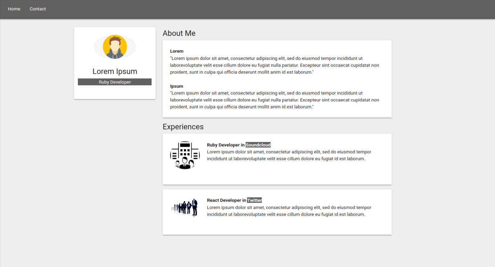

<hr>

# Dev Portfolio (SPA)

Bem-vindo ao Dev Portfolio (SPA)! 🚀 Este é um repositório dedicado ao projeto Dev Portfolio (SPA). Projeto realizado como exercício de montagem de currículo utilizando React para Single Page Application.

## Descrição

Dev Portfolio (SPA) é uma aplicação web que recria a interface de um portfolio, contendo informações relevantes para um desenvolvedor. Este repositório contém o código-fonte e os arquivos essenciais para executar a aplicação em sua máquina local.

## Funcionalidades Principais

- 🌐 Recriação de Portfolio
- 📚 Recursos Interativos
- 💻 Ambiente de Desenvolvimento Integrado (IDE)

## Instruções de Instalação

Siga estas etapas para configurar o Dev Portfolio (SPA) em sua máquina:

1. **Clone o Repositório:**

   ```bash
   git clone https://github.com/devbdallagnol/single-page-application-obc
   ```

2. **Instale os pacotes:**

   ```bash
   npm install
   ```

3. **Rode a aplicação:**

   ```bash
   npm start
   ```

### Contribuição

Contribuições são bem-vindas! Se você deseja melhorar o projeto, siga estas diretrizes:

1. Faça um Fork do projeto
2. Crie uma nova branch `git checkout -b feature/nova-feature`
3. Faça commit das suas alterações `git commit -am 'Adiciona nova feature'`
4. Faça push para a branch `git push origin feature/nova-feature`
5. Abra um Pull Request

### Contato

Se precisar de ajuda ou tiver alguma dúvida, sinta-se à vontade para entrar em contato:

Desenvolvedor: @devbdallagnol
